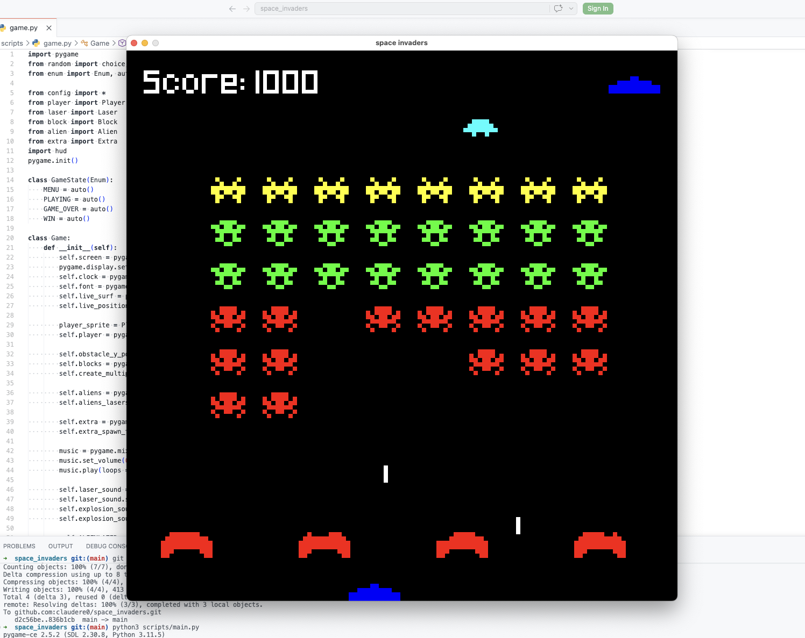

# Space Invaders (Pygame)



A clone of the classic arcade game Space Invaders, written in Python using the Pygame library.
This project demonstrates a significant step forward compared to previous games (such as Breakout), with a focus on proper architecture, sprite management, and modularity.

## What I Learned in This Project

Compared to previous projects, several major improvements and new concepts were implemented here:

1. **Modular Architecture (Separation of Concerns):**
   - The code is no longer monolithic. All logic is divided into separate files within the `scripts/` folder (`player.py`, `alien.py`, `laser.py`, etc.).
   - User Interface (HUD) logic is entirely extracted into `hud.py`, making the main game class much cleaner.

2. **Advanced Pygame Sprites:**
   - Instead of manually managing object lists and writing custom collision checks, the project now uses `pygame.sprite.Sprite`.
   - Utilized sprite groups (`pygame.sprite.Group`, `GroupSingle`) for simultaneous updating (`update()`), rendering (`draw()`), and built-in, efficient collision detection (`pygame.sprite.spritecollide`).

3. **State Management:**
   - Transitioned from simple variables to using `Enum` (`GameState`), which makes transitions between the menu, game, and win/loss screens safer and more readable.

4. **Event System & Timers:**
   - Utilized custom Pygame events (`pygame.USEREVENT`) and timers (`pygame.time.set_timer`) to control the alien shooting frequency. This is a cleaner approach than manually calculating `delta time` in the `update` method for every action.

5. **Multimedia (Audio and Graphics):**
   - Full integration of sound effects (shooting, explosions) and background music using `pygame.mixer`.
   - Working with image sprites (`pygame.image.load`) with transparency support (`convert_alpha()`) and using custom fonts (`Pixeled.ttf`).

## Features

- Classic gameplay: destroy waves of aliens, dodge their lasers, and take cover behind blocks.
- Destructible shields (blocks) that take damage from both your lasers and enemy shots.
- A bonus ship (Extra) that periodically flies across the top of the screen, granting extra points.
- Sound effects and a retro font to immerse you in the atmosphere.
- Smooth, frame-rate independent movement (Delta time).

## Controls

| Key | Action |
|---------|----------|
| **←** | Move Left |
| **→** | Move Right |
| **Space** | Shoot |
| **Enter** | Start Game (in menu) |
| **R** | Restart (after win/loss) |
| **Q** | Quit Game |

## Project Structure

```
space_invaders/
│
├── scripts/
│   ├── game.py       # Main game class and loop
│   ├── player.py     # Player class
│   ├── alien.py      # Alien class
│   ├── block.py      # Shield blocks
│   ├── laser.py      # Player and alien lasers
│   ├── extra.py      # Bonus flying ship
│   ├── hud.py        # UI rendering (score, lives, menu)
│   ├── config.py     # Constants (screen size, colors, settings)
│   └── main.py       # Program entry point
│
├── images/           # Graphical assets
├── audio/            # Sounds and music
├── font/             # Font files
└── README.md
```

## Installation & Running

1. Ensure you have Python installed.
2. Install the pygame library:
   ```bash
   pip install pygame
   ```
3. Navigate to the `scripts` directory and run the game:
   ```bash
   cd scripts
   python main.py
   ```
